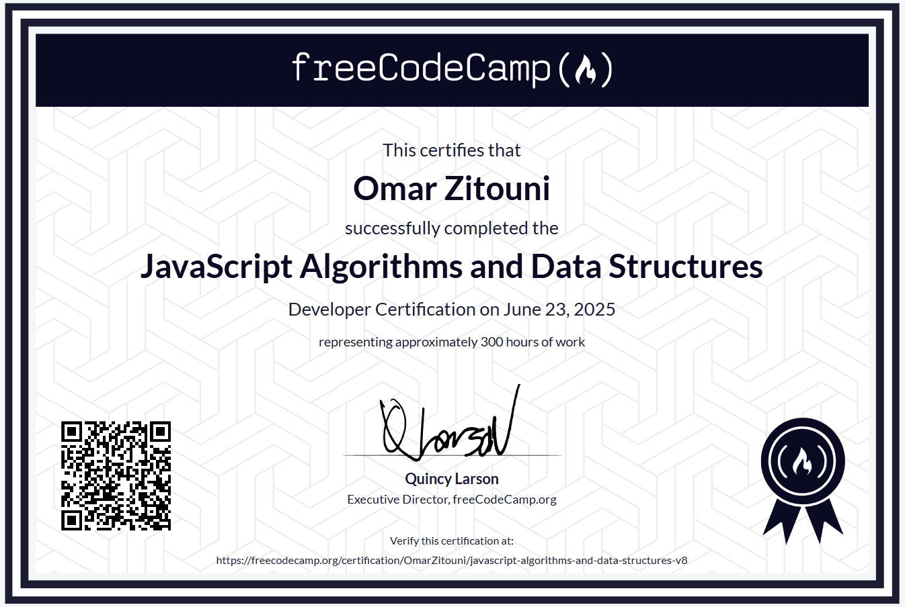

# Javascript Certification Projects
These projects were built as part of the **JavaScript Algorithms and Data Structures** on [Freecodecamp](https://www.freecodecamp.org/learn/javascript-algorithms-and-data-structures-v8/).

## Certificate

## How to Use

Follow these steps to run any of the projects locally on your machine:

1. Clone the repository or download the project(s) folder
1. Open the project with live server:
    * Open the project in [Visual Studio Code](https://code.visualstudio.com/)
    * Download Live Server Extension by Ritwick Dey
    * In the project folder, right-click on index.html and select "Open with Live Server"